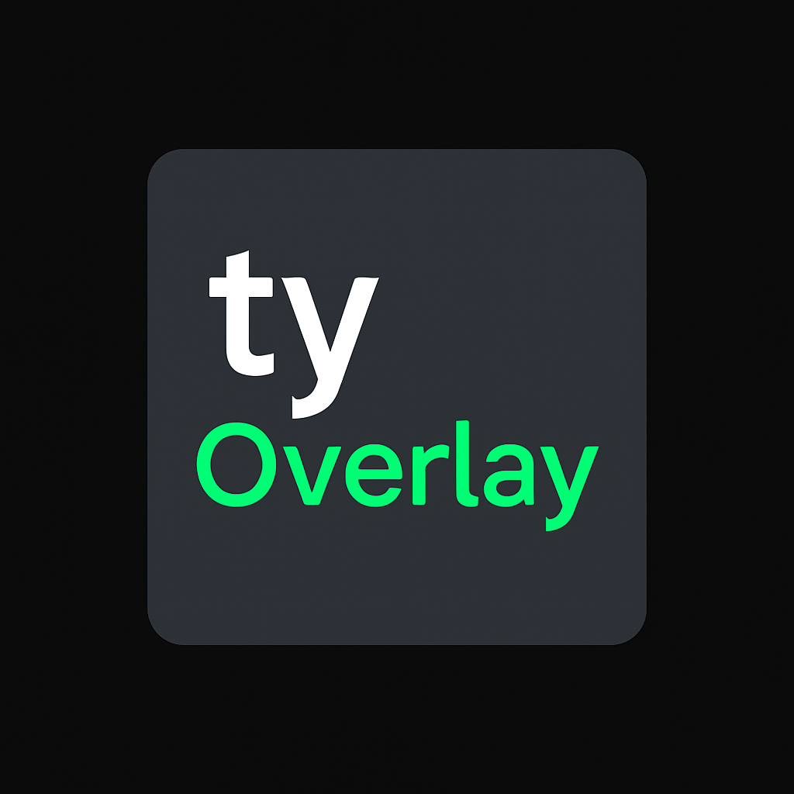

  

# tyOverlay
A gaming overlay that is a work in progress, lacks intended features, but I will be slowly adding more to it

**tyOverlay** is a custom gaming overlay designed to display visual key labels on screen to match a physical 6-key mechanical macro pad. It's a personal project still in development, but I plan to add more features over time. 

Compilation is currently Windows-only and should work out of the box—just compile main.cpp with any C++20-capable compiler.

## Features

- Realtime overlay with on-screen macro labels
- Lightweight resource usage
- Real-time clock and keypress highlights
- Press F8 to close the overlay

## Planned Features

- GUI config window
- Planned ImGui integration (or a custom-built alternative) for GUI components. Likely will start with ImGui, then transition to a custom version to keep the utility fully original.
- Toggleable custom crosshair with presets and color options
- Highlight effects for complex combos
- Foreground window display
- Notes/annotations overlay toggle
- FPS counter
- GPU usage, VRAM transfer rate, graphics clock speed
- CPU usage and per-core clock speeds
- Input latency tester
- On-screen countdown/timer
- Colorblind mode and theme customization
- Config file support for multiple profiles
- Auto-load macro profiles based on active application
- Custom theme and scaling options
- Linux support
- Optional GUI macro binding for basic HID macro pads (experimental feature intended to support simple custom macro boards with user-friendly key remapping; long-term goal)

Note: All planned features are long-term goals. tyOverlay is written in C++ and developed as a personal side project, so progress may be slow. Please do not expect rapid updates as I am suffering from leukemia which ruins my energy levels & makes life including coding harder. Thank you for your understanding. :)

## Status

🛠️ Work in Progress (WIP) — functional but incomplete. Expect changes and improvements over time.

## License

This project is licensed under the [MIT License](LICENSE).

